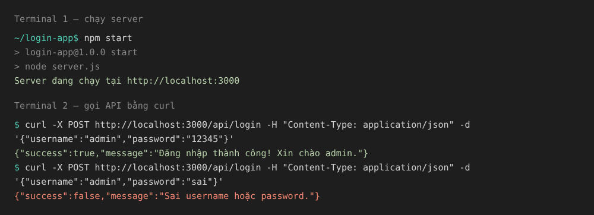
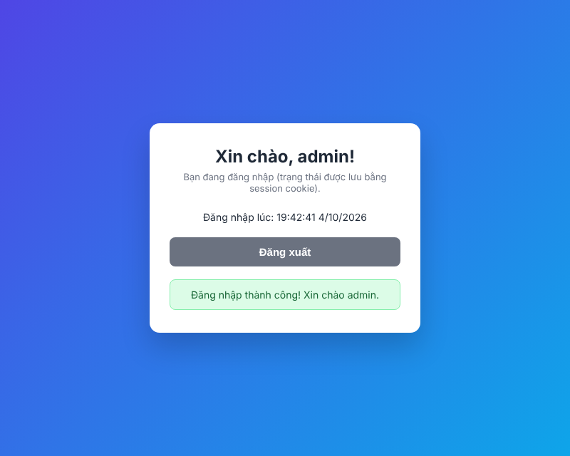
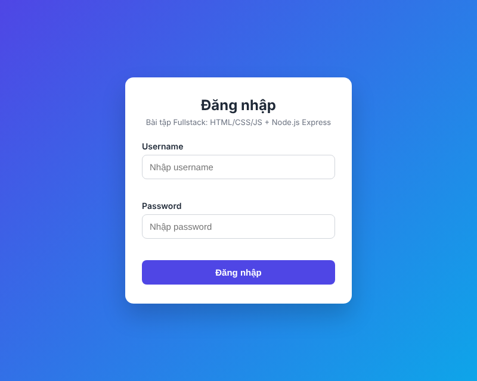
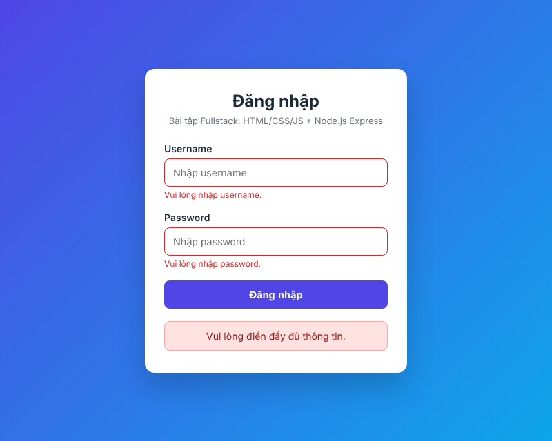
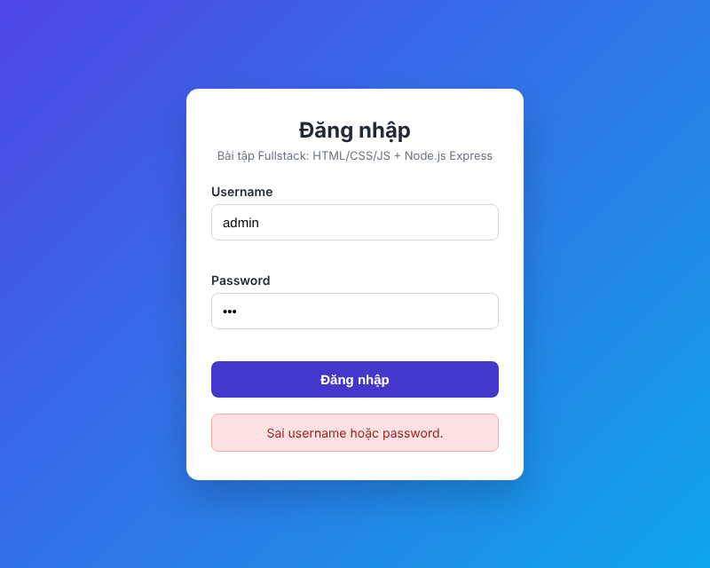

# Bài tập: Ứng dụng Web đăng nhập đơn giản (Fullstack)

Frontend: **HTML + CSS + JavaScript (fetch)** · Backend: **Node.js + Express** · Lưu trạng thái: **express-session (cookie)**

## Cấu trúc thư mục

```
login-app/
├── server.js            # Backend Express: API /api/login, /api/me, /api/logout
├── package.json
├── public/              # Frontend (Express phục vụ dưới dạng file tĩnh)
│   ├── index.html       # Form đăng nhập
│   ├── style.css        # Giao diện
│   └── script.js        # Validate + gửi AJAX bằng fetch
└── screenshots/         # Ảnh chụp demo
```

## Cách chạy

Yêu cầu: Node.js 18 trở lên.

```bash
cd login-app
npm install        # cài express, express-session
npm start          # hoặc: node server.js
```

Mở trình duyệt tại **http://localhost:3000**

- Tài khoản đúng: `admin` / `12345` → hiện "Đăng nhập thành công"
- Sai thông tin → hiện "Sai username hoặc password."
- Để trống → báo lỗi ngay trên form (validate phía client)

## API

| Method | URL           | Body (JSON)                          | Kết quả |
|--------|---------------|--------------------------------------|---------|
| POST   | `/api/login`  | `{ "username": "...", "password": "..." }` | 200 `{success:true}` · 401 sai thông tin · 400 dữ liệu không hợp lệ |
| GET    | `/api/me`     | –                                    | `{ loggedIn, user }` theo session |
| POST   | `/api/logout` | –                                    | Huỷ session |

Test nhanh bằng curl:

```bash
curl -X POST http://localhost:3000/api/login -H "Content-Type: application/json" -d "{\"username\":\"admin\",\"password\":\"12345\"}"
```

## Các yêu cầu đã thực hiện

1. **Frontend**: form Username/Password, CSS làm đẹp, JS kiểm tra không để trống (báo lỗi dưới từng ô).
2. **Backend**: Express, API `POST /api/login`, kiểm tra `admin` / `12345`.
3. **Kết nối**: `fetch()` gửi JSON, hiển thị kết quả ngay trên trang, không reload (`e.preventDefault()`).
4. **Mở rộng**:
   - Validate backend: kiểm tra kiểu dữ liệu, rỗng, độ dài username 3–30, ký tự cho phép, password ≤ 100 ký tự, bắt lỗi JSON sai định dạng. Trả đúng mã HTTP (400/401).
   - Lưu đăng nhập bằng **session**: server lưu `req.session.user`, trình duyệt giữ cookie `connect.sid` (httpOnly). F5 trang vẫn còn đăng nhập; có nút Đăng xuất.
   - Ghi chú kiến trúc client–server: xem bên dưới.

## Ảnh chụp màn hình khi chạy demo thành công

> Tất cả ảnh nằm trong thư mục [`screenshots/`](screenshots/).

### 1. Server khởi động thành công và gọi API

Chạy `npm start`, terminal báo server đang chạy. Gọi `POST /api/login` bằng curl: đúng tài khoản trả `success: true`, sai tài khoản trả `success: false`.



### 2. Đăng nhập thành công (admin / 12345)

Thông báo "Đăng nhập thành công! Xin chào admin." hiện ngay trên trang, không reload. Trạng thái đăng nhập được lưu bằng session nên F5 vẫn còn đăng nhập.



### 3. Các trường hợp khác

**Giao diện form đăng nhập**



**Validate phía client: để trống Username/Password**



**Đăng nhập thất bại: sai mật khẩu**



## Ghi chú: Kiến trúc client–server trong ứng dụng

```
┌──────────────── Client (Trình duyệt) ────────────────┐         ┌────────── Server (Node.js + Express) ──────────┐
│ index.html  – cấu trúc (form)                        │  HTTP   │ express.static → trả HTML/CSS/JS               │
│ style.css   – trình bày                              │ ──────► │ express.json   → đọc body JSON                 │
│ script.js   – validate, fetch(), cập nhật DOM        │  JSON   │ express-session→ đọc/ghi session theo cookie   │
│ Cookie connect.sid (trình duyệt tự gửi kèm)          │ ◄────── │ Route /api/login: validate → so sánh → trả JSON│
└──────────────────────────────────────────────────────┘         └────────────────────────────────────────────────┘
```

**Luồng một lần đăng nhập:**

1. Trình duyệt gửi `GET /` → server trả `index.html`, rồi tải tiếp `style.css`, `script.js`.
2. Người dùng bấm "Đăng nhập" → `script.js` chặn submit mặc định, kiểm tra ô trống.
3. Hợp lệ → `fetch('POST /api/login')` với body JSON.
4. Server validate lại (không tin dữ liệu từ client), so sánh tài khoản:
   - Đúng → tạo session, trả `200` + header `Set-Cookie: connect.sid=...`
   - Sai → trả `401` / `400` kèm thông báo lỗi.
5. JS nhận JSON, cập nhật DOM để hiện thông báo → **không reload trang** (đây là bản chất của AJAX).
6. Các request sau, trình duyệt tự gửi cookie → server biết người dùng đã đăng nhập (`GET /api/me`).

**Nhận xét:**

- **Tách biệt trách nhiệm**: client lo giao diện và trải nghiệm; server lo logic nghiệp vụ, xác thực và dữ liệu. Hai bên chỉ giao tiếp qua HTTP + JSON, nên có thể thay frontend (ví dụ app mobile) mà không đổi backend.
- **Validate ở cả hai phía**: validate client giúp phản hồi nhanh; validate server mới là bắt buộc vì client có thể bị bỏ qua (gọi API trực tiếp bằng curl/Postman).
- **HTTP là stateless**: mỗi request độc lập, nên cần cookie/session để "nhớ" người dùng. Session lưu ở server (bộ nhớ RAM trong bài này), cookie chỉ chứa ID.
- Đây là kiến trúc **3 tầng thu gọn**: Presentation (trình duyệt) – Application (Express) – Data (ở đây là tài khoản cố định; thực tế sẽ là CSDL).

**Hạn chế / hướng cải tiến** (ngoài phạm vi bài tập): mật khẩu nên lưu dạng băm (bcrypt) trong CSDL; dùng HTTPS và `cookie.secure`; secret lấy từ biến môi trường; giới hạn số lần đăng nhập sai (rate limit); session store bền vững (Redis) thay vì RAM.
