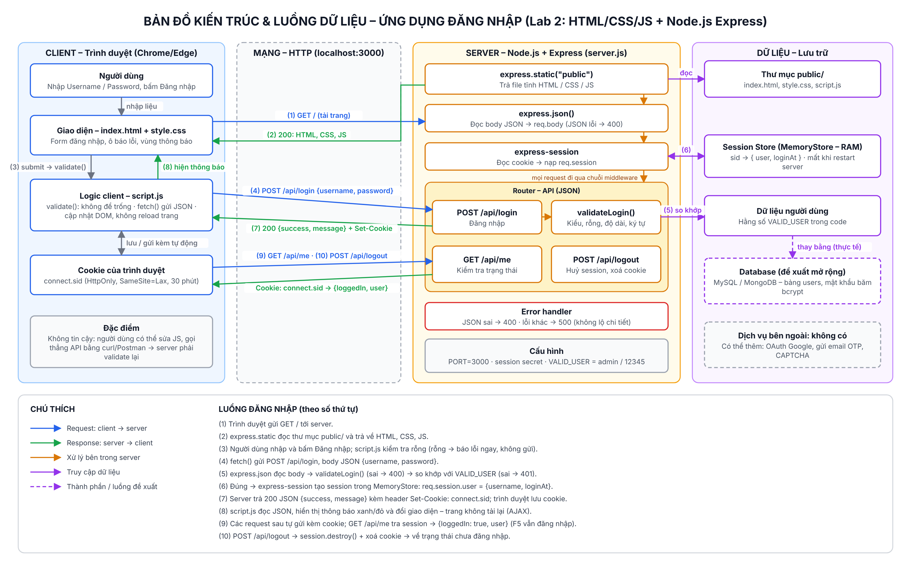
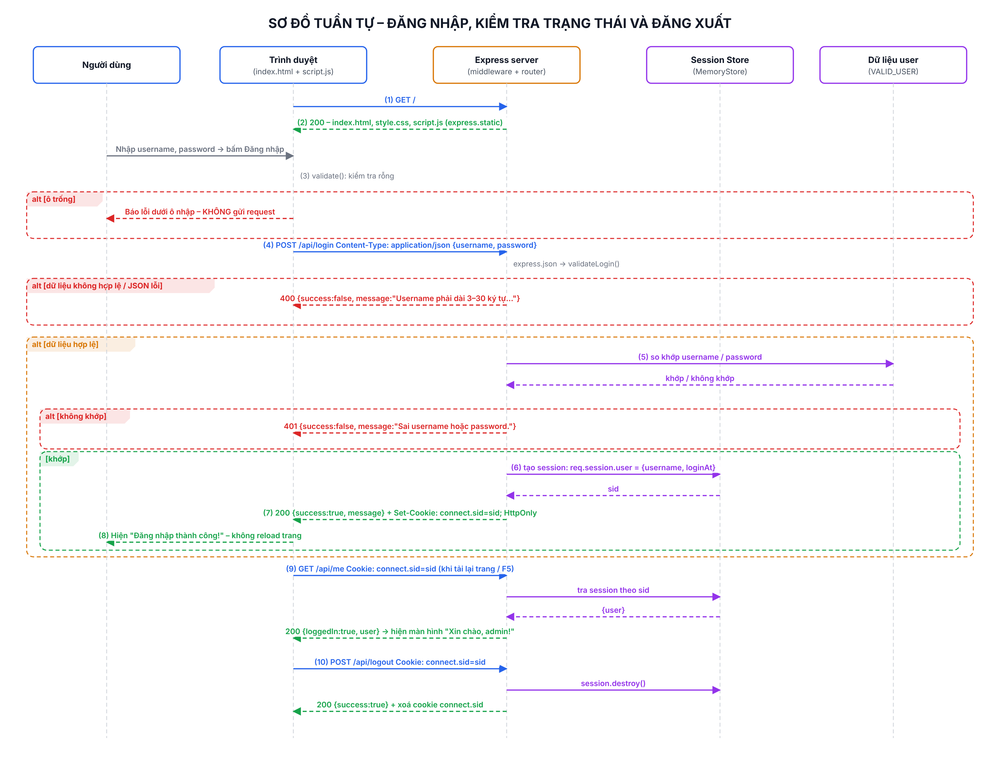

# Lab 3: Bản đồ kiến trúc và luồng dữ liệu của ứng dụng Web

Ứng dụng được phân tích: **ứng dụng đăng nhập ở Lab 2** (`../lab2/login-app`), gồm HTML/CSS/JS, Node.js + Express và express-session.

## Các file nộp

| File | Nội dung |
|---|---|
| `bao-cao-lab3.docx` / `bao-cao-lab3.pdf` | Báo cáo 2 trang: thành phần, luồng dữ liệu, phân tích bảo mật |
| `so-do-kien-truc.pdf` | Sơ đồ (2 trang A3): bản đồ kiến trúc và sơ đồ tuần tự |
| `so-do-kien-truc.png` | Bản đồ kiến trúc và luồng dữ liệu (ảnh) |
| `so-do-tuan-tu.png` | Sơ đồ tuần tự đăng nhập / kiểm tra trạng thái / đăng xuất (ảnh) |
| `so-do-kien-truc.drawio` | File gốc của sơ đồ: mở bằng https://app.diagrams.net (File → Open) hoặc extension Draw.io Integration trong VS Code |

## Bản đồ kiến trúc

## Sơ đồ tuần tự

