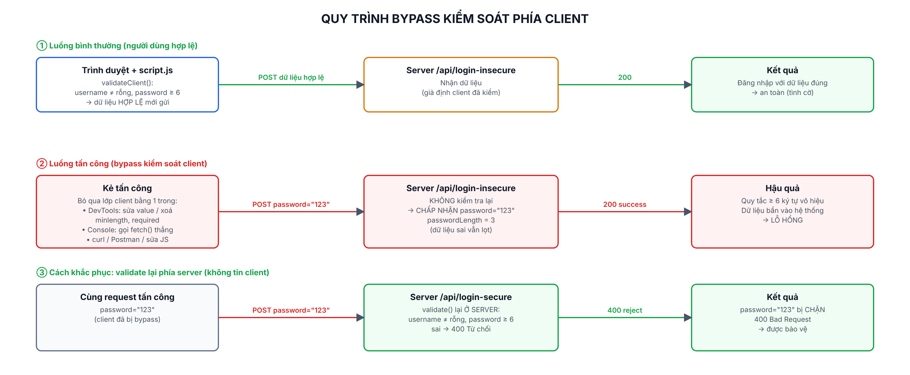

# Lab 4: Bypass kiểm soát phía client trên form đăng nhập

> Mục đích học tập: chứng minh vì sao **không được chỉ dựa vào kiểm tra phía client**, và phải validate lại ở server. Chỉ thao tác trên app demo tự dựng.

## Các file

| File | Nội dung |
|---|---|
| `bao-cao-lab4.docx` / `.pdf` | Báo cáo 2 trang: quy trình bypass, rủi ro, giải pháp |
| `so-do-bypass.png` | Sơ đồ 3 luồng: bình thường / tấn công / khắc phục |
| `demo-app/` | App demo Node.js + Express |
| `screenshots/` | Ảnh minh hoạ client chặn, bypass thành công, server secure từ chối |

## Chạy app demo

```bash
cd demo-app
npm install
npm start          # mở http://localhost:4000
```

Form có kiểm soát client: **username không trống** và **password ≥ 6 ký tự**.
Có nút chọn gửi tới 1 trong 2 endpoint:

- `POST /api/login-insecure` — **không** kiểm tra lại (có lỗ hổng).
- `POST /api/login-secure` — **có** kiểm tra lại (cách đúng).

## Các bước thực hành (tự làm lại để chụp ảnh nộp)

1. Nhập `admin` / `123` → client hiện lỗi đỏ, không gửi. → chụp `1-client-chan.png`.
2. Mở **DevTools (F12) → Elements**: xoá `minlength="6"` và `required` ở ô password. Sang **Console** gạy lệnh:
   ```js
   fetch('/api/login-insecure', { method:'POST',
     headers:{'Content-Type':'application/json'},
     body: JSON.stringify({username:'admin', password:'123'}) })
     .then(r => r.json()).then(console.log)
   ```
   Server insecure trả `success:true, passwordLength:3` → bypass thành công. → `2-bypass-insecure-chap-nhan.png`.
3. Đổi endpoint sang `/api/login-secure` với cùng dữ liệu → server trả **400**, bị chặn. → `3-secure-tu-choi.png`.

Có thể thay DevTools bằng `curl` để thấy rõ client bị bỏ qua hoàn toàn:

```bash
curl -X POST http://localhost:4000/api/login-insecure -H "Content-Type: application/json" -d "{\"username\":\"admin\",\"password\":\"123\"}"
```

## Sơ đồ quy trình bypass


