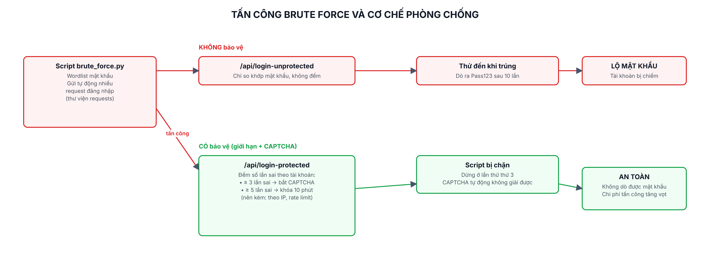

# Lab 5: Tấn công Brute Force và phòng chống

> Mục đích học tập: hiểu brute force **để biết cách phòng chống** bằng giới hạn số lần đăng nhập và CAPTCHA. Script tấn công chỉ chạy vào app demo tự dựng ở `localhost:5000`. Không dùng lên hệ thống của người khác.

## Các file

| File | Nội dung |
|---|---|
| `bao-cao-lab5.docx` / `.pdf` | Báo cáo 2 trang: tấn công, phòng chống, kết quả |
| `so-do-brute-force.png` | Sơ đồ tấn công và cơ chế phòng chống |
| `demo-app/` | App Node.js + Express (có user1/Pass123, 2 endpoint) |
| `attack/brute_force.py` | Script Python + requests mô phỏng brute force |
| `attack/ket-qua-*.txt` | Log kết quả chạy thử |
| `screenshots/` | Ảnh CAPTCHA, brute force thành công / bị chặn |

## Chạy

**1. Mở app demo** (cửa sổ terminal 1):
```bash
cd demo-app
npm install
npm start          # http://localhost:5000  (user1 / Pass123)
```

**2. Chạy tấn công** (cửa sổ terminal 2):
```bash
cd attack
pip install requests          # nếu chưa có
python brute_force.py unprotected   # -> dò ra mật khẩu sau 10 lần
python brute_force.py protected     # -> bị chặn ở lần thử thứ 3 (CAPTCHA)
```

## Hai endpoint để so sánh

- `POST /api/login-unprotected` — không giới hạn → brute force thành công.
- `POST /api/login-protected` — **sau 3 lần sai bắt CAPTCHA**, **sau 5 lần sai khóa 10 phút** → chặn brute force.

## Kết quả

| | Không bảo vệ | Có bảo vệ |
|---|---|---|
| Brute force | Tìm ra `Pass123` sau 10 lần | Bị chặn ở lần thứ 3 |


