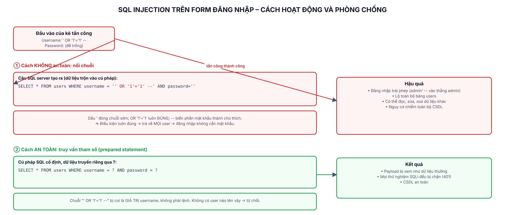

# Lab 6: SQL Injection và phòng chống

> Mục đích học tập: hiểu SQL Injection trên app giả lập của chính mình để biết cách chặn bằng truy vấn tham số (prepared statement). Chạy hoàn toàn trên `localhost`, môi trường mô phỏng.

## Các file

| File | Nội dung |
|---|---|
| `bao-cao-lab6.docx` / `.pdf` | Báo cáo 2 trang: tấn công, phân tích, phòng chống |
| `so-do-sql-injection.png` | Sơ đồ cơ chế SQLi và cách phòng chống |
| `demo-app/` | App Node.js + Express + SQLite (node:sqlite) |
| `attack/sqli_demo.py` | Script Python thử các payload SQLi |
| `attack/ket-qua-*.txt` | Log kết quả |
| `screenshots/` | Ảnh SQLi thành công / bị chặn |

## Yêu cầu

- **Node.js ≥ 22.5** (có sẵn module `node:sqlite`). Máy bạn Node 24 → chạy được, không cần cài thêm DB.
- Python + `requests` (cho script thử).

## Chạy

**1. Mở app demo** (terminal 1):
```bash
cd demo-app
npm install
npm start          # http://localhost:6060   (tài khoản thật: user1 / Pass123)
```
> Dùng cổng 6060 vì trình duyệt chặn cổng 6000.

**2. Thử SQL Injection** — trên web: nhập vào ô **Username**, để trống **Password**:
```
' OR '1'='1' --
admin' --
```
Chọn endpoint **vulnerable** → đăng nhập được (lỗ hổng). Chọn **secure** → bị chặn.

**3. Hoặc chạy script** (terminal 2):
```bash
cd attack
python sqli_demo.py vulnerable   # payload bypass thành công
python sqli_demo.py secure       # payload bị chặn
```

## Hai endpoint

- `POST /api/login-vulnerable` — nối chuỗi SQL → dính SQLi.
- `POST /api/login-secure` — truy vấn tham số `?` → an toàn.

## Kết quả

| Payload `' OR '1'='1' --` | vulnerable | secure |
|---|---|---|
| Kết quả | Đăng nhập được, trả về 3 user | Bị từ chối (401) |


