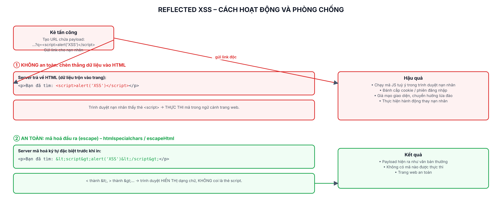

# Lab 7: Cross-Site Scripting (XSS) và phòng chống

> Mục đích học tập: hiểu Reflected XSS trên app giả lập của chính mình để biết cách chặn bằng mã hoá đầu ra (escape). Chạy trên `localhost`, môi trường mô phỏng.

## Các file

| File | Nội dung |
|---|---|
| `bao-cao-lab7.docx` / `.pdf` | Báo cáo 2 trang: khai thác, phân tích, phòng chống |
| `so-do-xss.png` | Sơ đồ cơ chế XSS và cách phòng chống |
| `demo-app/` | App Node.js + Express (2 trang tìm kiếm) |
| `attack/ket-qua-kiem-chung.txt` | Kết quả kiểm chứng bằng trình duyệt tự động |
| `screenshots/` | Ảnh XSS thực thi / bị chặn |

## Chạy

```bash
cd demo-app
npm install
npm start          # http://localhost:7070
```
> Dùng cổng 7070.

Trên web, nhập payload vào ô tìm kiếm:
```
<script>alert('XSS')</script>

```

- Chọn **/search-vulnerable** → trình duyệt bật `alert('XSS')` (lỗ hổng tồn tại).
- Chọn **/search-secure** → payload hiển thị dạng chữ, không chạy.

## Hai trang

- `GET /search-vulnerable?q=...` — chèn thẳng `q` vào HTML → dính XSS.
- `GET /search-secure?q=...` — `escapeHtml(q)` (tương đương `htmlspecialchars`) → an toàn.

## Kết quả

| Payload `<script>alert('XSS')</script>` | vulnerable | secure |
|---|---|---|
| Kết quả | Mã chạy (alert bật) | Hiện dạng chữ, không chạy |


