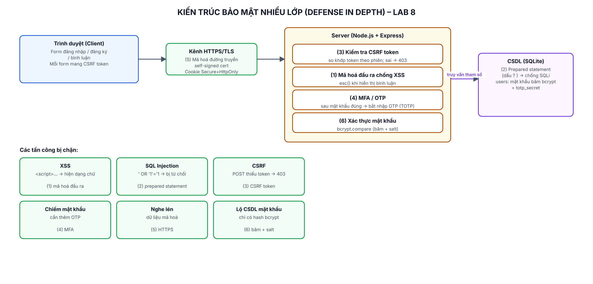

# Lab 8: Bảo vệ an toàn thông tin cho ứng dụng web

> App web an toàn gộp 7 biện pháp bảo mật. Chạy trên `localhost`, môi trường mô phỏng.

## 7 biện pháp đã triển khai

| # | Biện pháp | Vị trí trong `app/server.js` |
|---|---|---|
| 1 | Chống XSS – mã hoá đầu ra | hàm `esc()`, dùng khi in bình luận |
| 2 | Chống SQL Injection – prepared statement | mọi `db.prepare('... ?').run/get` |
| 3 | CSRF token | `csrfToken()` + middleware `checkCsrf` |
| 4 | MFA / OTP (TOTP – Google Authenticator) | `/otp`, otplib |
| 5 | HTTPS + cookie Secure/HttpOnly/SameSite | `https.createServer`, cấu hình session |
| 6 | Băm mật khẩu bcrypt + salt | `bcrypt.hashSync` / `compareSync` |

## Yêu cầu

- **Node.js ≥ 22.5** (có `node:sqlite`). Máy bạn Node 24 → OK.
- **OpenSSL** để tạo chứng chỉ HTTPS (Windows: cài Git for Windows là có sẵn).

## Chạy

```bash
cd app
npm install

# Tạo chứng chỉ HTTPS self-signed (chỉ làm 1 lần):
sh gen-cert.sh
#   Windows (nếu 'sh' không chạy): dùng Git Bash, hoặc chạy trực tiếp:
#   openssl req -x509 -newkey rsa:2048 -nodes -keyout certs/key.pem -out certs/cert.pem -days 365 -subj "/C=VN/O=Lab8/CN=localhost"

npm start          # https://localhost:8443
```

Mở trình duyệt tới **https://localhost:8443**. Vì là chứng chỉ tự ký, trình duyệt sẽ cảnh báo — bấm **Advanced → Proceed to localhost** (điều này bình thường cho môi trường demo).

> Nếu không có file chứng chỉ, app sẽ tự chạy bằng HTTP để bạn vẫn thử được, nhưng nên tạo cert để đúng yêu cầu HTTPS.

## Thử các tấn công (đều bị chặn)

- **SQL Injection:** ở trang Đăng nhập, Username nhập `' OR '1'='1` → bị từ chối.
- **XSS:** ở trang Bình luận, Nội dung nhập `<script>alert('XSS')</script>` → hiện dạng chữ, không chạy.
- **CSRF:** gửi POST không kèm token (ví dụ bằng công cụ ngoài) → HTTP 403.
- **MFA:** đăng nhập đúng `user1 / Pass123!` → bị bắt nhập OTP. Lấy OTP: mở link "Xem mã QR", quét bằng **Google Authenticator**, nhập mã 6 số.
- **bcrypt:** mật khẩu trong CSDL lưu dạng `$2b$10$...`, không phải chữ thật.

## Các file

| | |
|---|---|
| `app/` | Mã nguồn ứng dụng |
| `bao-cao-lab8.docx` / `.pdf` | Báo cáo |
| `so-do-bao-mat.png` | Sơ đồ kiến trúc bảo mật nhiều lớp |
| `test/ket-qua-kiem-thu.txt` | Kết quả kiểm thử |
| `screenshots/` | Ảnh các tấn công bị chặn |


