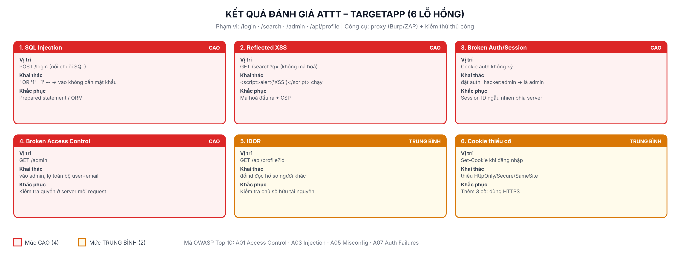

# Lab 9: Đánh giá an toàn thông tin cho ứng dụng web

> Quy trình đánh giá ATTT (pentest) trên ứng dụng mục tiêu tự dựng. Chỉ chạy trên `localhost`, môi trường được phép.

## Thành phần

| | |
|---|---|
| `target-app/` | **Ứng dụng mục tiêu** (cố ý chứa lỗ hổng) để đánh giá |
| `assessment/assess.py` | Script đánh giá tự động (requests) |
| `assessment/ket-qua-danh-gia.txt` | Kết quả chạy |
| `bao-cao-lab9.docx` / `.pdf` | Báo cáo đánh giá |
| `so-do-danh-gia.png` | Bản đồ 6 lỗ hổng theo mức độ |
| `screenshots/` | Ảnh khai thác minh hoạ |

> ⚠ `target-app` là app **cố ý mất an toàn** để học đánh giá — KHÔNG dùng cách viết này cho app thật.

## Chạy

**1. Khởi động ứng dụng mục tiêu** (terminal 1):
```bash
cd target-app
npm install
npm start          # http://localhost:9090
```

**2. Đánh giá** — hai cách:

a) Bằng script (terminal 2):
```bash
cd assessment
pip install requests
python assess.py
```

b) Thủ công bằng trình duyệt + Burp Suite/OWASP ZAP (cấu hình proxy để bắt traffic), thử:
- `/login`: Username = `' OR '1'='1' --` → vào không cần mật khẩu (SQLi).
- `/search?q=<script>alert('XSS')</script>` → script chạy (XSS).
- Sửa cookie `auth=hacker:admin` rồi vào `/admin` → chiếm quyền admin.
- `/api/profile?id=1,2,3` → đọc hồ sơ người khác (IDOR).

## 6 lỗ hổng phát hiện

| # | Lỗ hổng | Mức | OWASP | Khắc phục |
|---|---|---|---|---|
| 1 | SQL Injection | CAO | A03 | Prepared statement |
| 2 | Reflected XSS | CAO | A03 | Mã hoá đầu ra + CSP |
| 3 | Broken Auth/Session | CAO | A07 | Session ID phía server |
| 4 | Broken Access Control | CAO | A01 | Kiểm tra quyền ở server |
| 5 | IDOR | TB | A01 | Kiểm tra chủ sở hữu |
| 6 | Cookie thiếu cờ | TB | A05 | HttpOnly/Secure/SameSite |

Phiên bản đã khắc phục tất cả các lỗ trên là ứng dụng ở **Lab 8**.


